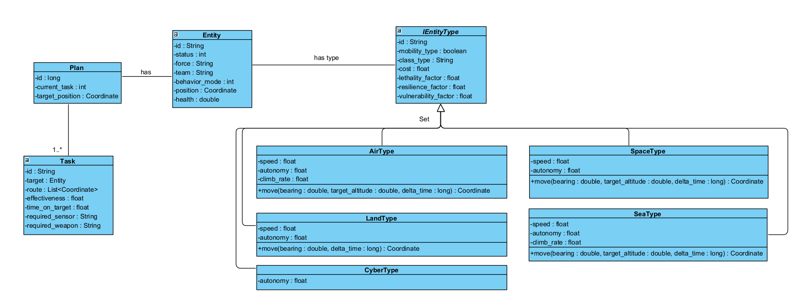

## ⚒️⚒️ The Physical Engine Model

The **Physical Engine** is responsible for simulate the physical caractheristics of the simulation entities. There are four models: **cyber**, **space**, **sea**, **land**, and **air** entities.    

The core class is **Entity**, it represents a entity in the environment and has a _plan_ and a _type_. A Entity has these important paramenters:
- **status**: identifies the quality of the entity and can have the following values: {0 = no started, 1 = started, 2 = finished, and -1 = destroyed).
- **team**: {BLUE, RED, GREEN}
- **behavior**: { 0 = neutral, 1  = reactive, and -1 = aggressive}.
- **health**: can be a value between 0 and 1.

An entity has a type (AIR, LAND, SEA, SPACE, or CYBER). The type has these parameters:
- **class_type**: class of entity (submarine, figther_jet, etc.)
- **cost**: it represents how much value the entity has. It can be a value between 0 and 1.
- **lethality_factor**: represents the capacity to cause significant harm and destruction.
- **resilience_factor**: represents the process of adapting well in the face of adversity,  threats, or significant sources of stress.
- **vulnerability_factor**:  is the opposite of resilience; it is the weakness that the presence of a threat can exploit. 

Depending on the entity type, each can have complementary attributes, like speed, autonomy, climb rate, etc.
- speed (m/s)
- autonomy (hours)
- climb_rate(m/s)

