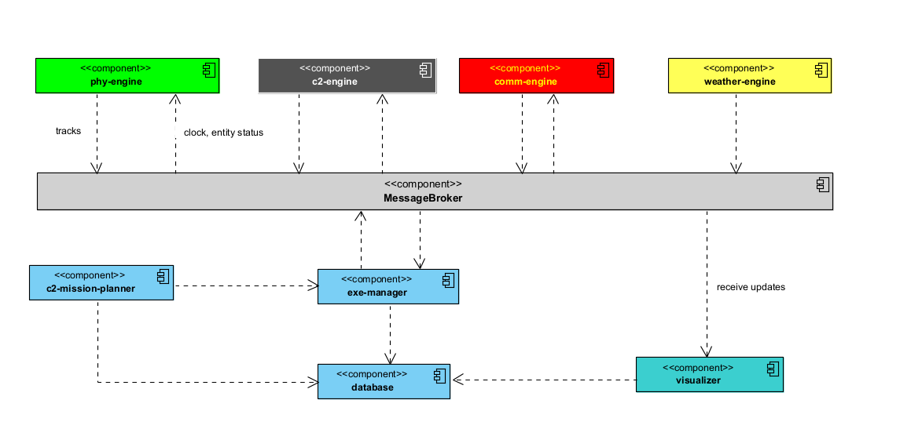

  

## 📝 Table of Contents

- [About the Project](#about)
- [Physical Engine Model](/PHY-ENGINE.md)
- [License](/LICENSE)

## 🐍 What is Boomslang C2 Simulator? 

**Boomslang** is a C2 simulator that provides an open-source tool to simulate new C2 doctrines and exercises. The main idea is to offer a simplistic modeling tool, enabling the design of complex exercises with different types of forces (air, land, navy, space, and cyber) and missions, and through his engine, analyze the combination of individuals effects, providing to the analyst the cost, impact, and risk of the scenario. Moreover, it has an extensible design, enabling you to extend it to support your specific problem.

Its name originated from a giant, highly venomous snake in the family Colubridae. The boomslang can open its jaws as wide as 170 degrees when biting. Its venom is highly potent and contains a hemotoxin that disrupts a human's blood coagulation. In addition, the poison is slow-acting, which helps buy time to obtain an anti-venom.

<h2> Boomslang C2 Simulator General Architecture</h2>

Boomslang C2 simulator uses a **_publish-subscribe architecture_**. Each simulation engine publishes the status of its entities as it consumes the simulation status produced by other engines to their internal calculus. **Exercise Manager** is responsible for the time management and synchronization of all machines involved in the simulation environment. During its initialization, Exercise Management reads the plans saved in a **Database_ component** and loads all required framework components to run a simulator. 

The main engine components of Boomslang C2 simulator are: **Physical Engine**, **C2 Simulator Engine**, **Communication Engine**, and **Weather Engine**. 

- **Physical Engine** is responsible for calculating the movement of the entities in the simulation environment. The entity movement is impacted by the **_weather factor_** (provided by the Weather Engine) and the **_health_** of the entity.
- **C2 Simulator Engine** is responsible for performing the entity's mission. Each entity has a group of capacities that produces effects in the simulation environment. The factors involved in the entity performance are the **_weather_** (from the Weather Engine), the entity's **_health_**, and **_residual effects_** produced by the other entities.
-  **Communication Engine** calculates the communication effects caused by interference in the channels existent in the simulation environment. Each entity to perform its mission requires communication capabilities. The entities can have **_active sensors_** and **passive ones**. The activity enables that entity causes anomalies in the channels, while the passive only suffer these effects. The factors involved in the entity communication performance are the **_weather_** (from the Weather Engine), the entity's **_radio health_**, and **_residual effects_** produced by the other entities.
- **Weather Engine** is responsible for simulating several types of weather conditions, enabling the other engines can calculate the impact of these situations on the performance of the entities. From a practical perspective, the weather simulations are based on a probabilistic function that better represents the weather condition in the geographic place where the exercise will happen.

An important element in the simulator arcitecture is the **MessageBroker**, which is responsible for intercmediate the communication of all agents in the simulation environment.

The **Database** is a logical abstraction of the management of JSON files used in configuring all entities and engines in the simulation environment. There are two groups of files: **_database_** and **_exercise_** files. These **database files** are located in **resources/data/** and describe the basic information required to perform the simulation and consumed internally by the engines. 

The **exercise** files describe a specific exercise and are saved inside the folder **resources/exe**. They are:
-**simulation.json**: it is the main file of the simulation; all the other files are dependent on the information provided by this file.
- **plans.json** is the file that describes the entities involved in the exercise environment and its plans.
- **weather.json**: it is the file that describes the several distributions and other probabilistic information of weather scenarios.

