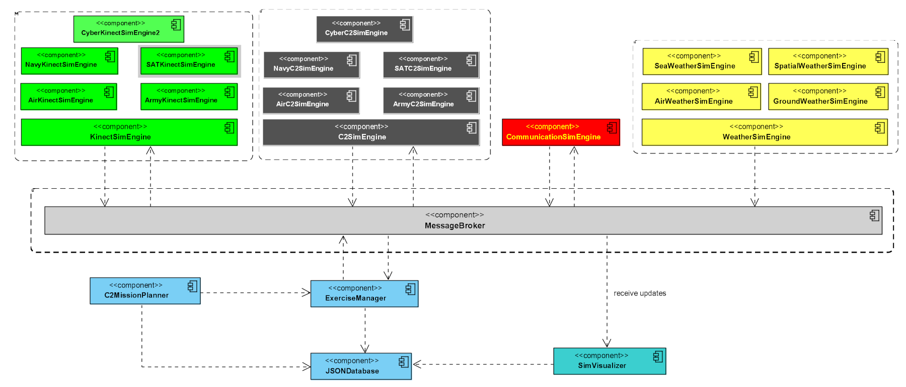

# boomslang-c2-sim

<h2> What is Boomslang C2 Simulator? </h2>

<b>Boomslang</b> is a C2 simulator that provides an open-source tool to simulate new C2 doctrines and exercises. The main idea is to offer a simplistic modeling tool, enabling the design of complex exercises with different types of forces (air, land, navy, space, and cyber) and missions, and through his engine analyze the combination of individuals effects, providing to the analyst the cost, impact, and risk of the scenario. Moreover, it has an extensible design, enabling you to extend it to support your specific problem.

Its name is originated from a large, highly venomous snake in the family Colubridae. The boomslang can open its jaws as wide as 170 degrees when biting. Its venom is highly potent and contains a hemotoxin that disrupts a human's blood coagulation. That said, the venom is slow-acting, which helps buy time to obtain and anti-venom.

<h2> Boomslang C2 Simulator General Architecture</h2>

Boomslang C2 simulator uses a <b>publish-subscribe architecture</b>. Each simulation engine publishes the status of their entities, as consume the simulation status produced by other engines to their internal calculus. <b>Exercise Manager</b> is responsible for the time management and synchronization of all machines involved in the simulation environment. During its initialization, Exercise Management read the plans saved in the JSON Database component, starts the WeatherSimEngine(s), and loads the KinectSimEngine(s) C2SimEngine(s), and CommunicationSimEngine(s), using previous information.

The main components are: <i>KninectSimEngine</i>, <i>C2SimEngine</i>, <i>CommunicationSimEngine</i>, and <i>WeatherSimEngine</i>. 

The <b>KninectSimEngine</b> is responsible for calculating the movement of the entities in the simulation environment. The entity movement is impacted by the <i><b>weather factor</b></i> (provided by the WeatherSimEngine) and the <i><b>health</b></i> of the Kinect entity.

The <b>C2SimEngine</b> is responsible for performing the mission of the entity. Each entity has a group of capacities that produces effects in the simulation environment. The factors involved in the entity performance are the <i><b>weather</b></i> (from the WeatherSimEngine), the entity's <i><b>health</b></i>, and <b><i>residual effects</b></i> produced by the other entities.

The <b>CommunicationSimEngine</b> calculates the communication effects caused by interference in the channels existent in the simulation environment. Each entity to perform its mission requires communication capabilities. The entities can have <b><i>active sensors</i></b> and <b><i>passive ones</i></b>. The activity enables that entity causes anomalies in the channels, while the passive only suffers these effects.  The factors involved in the entity communication performance are the <b><i>weather</i></b> (from the WeatherSimEngine), the entity's <b><i>radio health</i></b>, and <b><i>residual effects</i></b> produced by the other entities.

The <b>WeatherSimEngine</b> is responsible for simulating several types of weather conditions, enabling that the other engines can calculate the impact of these situations on the performance of the entities.  From a practical perspective, the weather simulations are based on a probabilistic function that better represents the weather condition in the geographic place where the exercise will happen.

The JSONDatabase is a logical abstraction of the management of JSON files used in configuring all entities and engines in the simulation environment. There are two groups of files: exercise and database files. 

The exercise files describe a specific exercise. They are:

- <b>simulation.json</b>: it is the main file of simulation; all the other files are dependent on the information provided by this file. It is located in the folder <b><i>resources/exe</i></b>.

- <b>entities.json</b>: it is the file that describes the entities involved in the exercise environment.

- <b>weather.json</b>: it is the file that describes the several distributions and other probabilistic information of weather scenarios.

- <b>plans.json</b>: it is the file that describes the plans of the entities (C2 and Kinect).

The database files are files that describe the basic information required to perform the simulation and consume internally by the engines.

